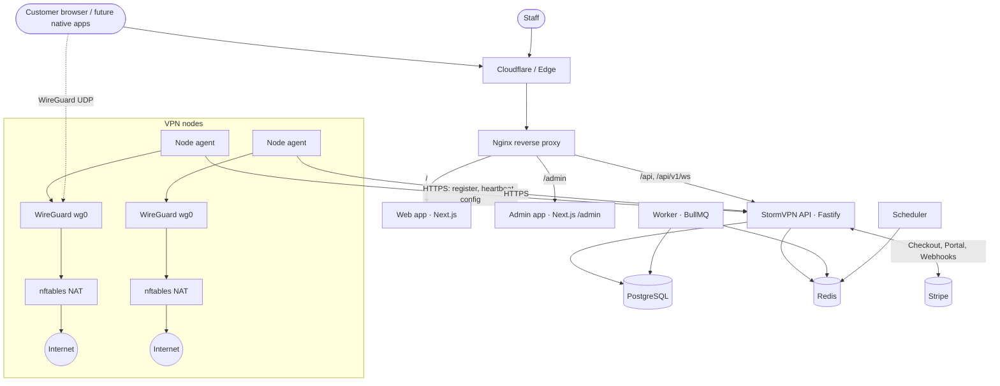
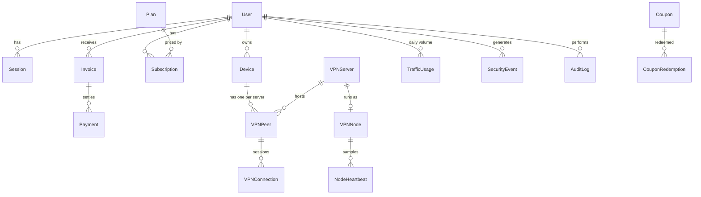
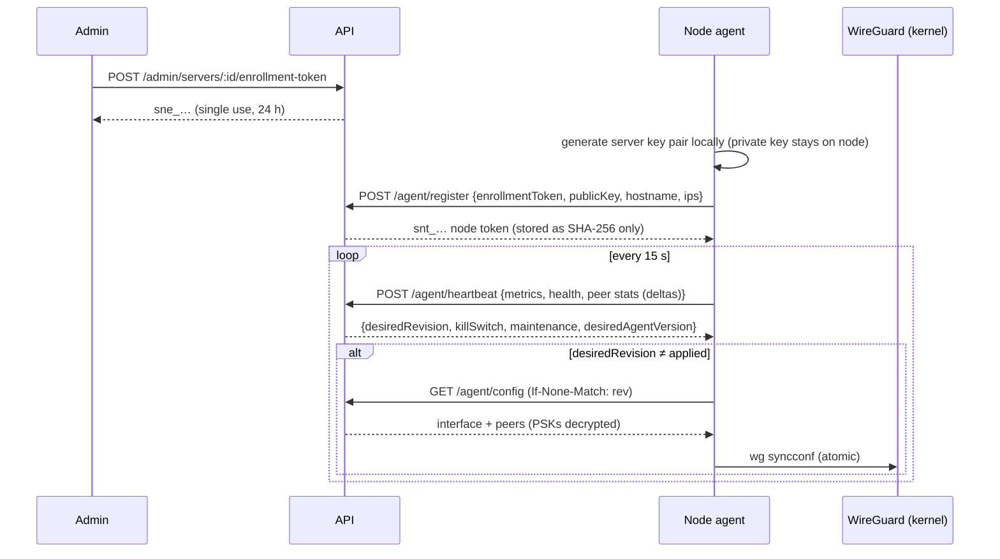
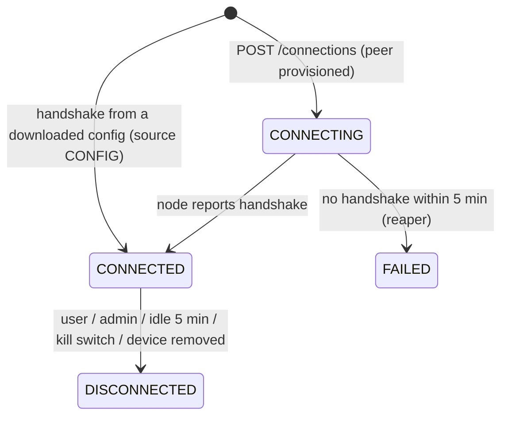

# Architecture

## Overview



| Component                              | Responsibility                                                                                                                                | Scaling                                                       |
| -------------------------------------- | --------------------------------------------------------------------------------------------------------------------------------------------- | ------------------------------------------------------------- |
| **API** (`apps/api`)                   | REST (`/api/v1`), WebSocket (`/api/v1/ws`), auth, VPN control plane, billing, admin, node agent endpoints, Prometheus `/metrics`              | Stateless, horizontal (sessions/rate limits/pub-sub in Redis) |
| **Web** (`apps/web`)                   | Landing, auth flows, customer dashboard                                                                                                       | Stateless, static prerender + client data fetching            |
| **Admin** (`apps/admin`)               | Staff panel under `/admin`                                                                                                                    | Stateless                                                     |
| **Worker** (`services/worker`)         | Email delivery, maintenance jobs (node health, connection reaper, traffic enforcement, subscription lifecycle, retention cleanup, abuse scan) | Horizontal (BullMQ)                                           |
| **Scheduler** (`services/scheduler`)   | Registers repeatable job schedules (idempotent, safe with replicas)                                                                           | 1+ replicas                                                   |
| **Node agent** (`services/node-agent`) | Runs on each VPN host: registration, heartbeats/metrics, WireGuard peer sync, health checks                                                   | One per node                                                  |
| **PostgreSQL**                         | System of record (Prisma 7)                                                                                                                   | Primary + replicas / managed service                          |
| **Redis**                              | Rate limits, session cache, brute-force counters, BullMQ queues, realtime pub/sub                                                             | Managed Redis / Sentinel                                      |

## Monorepo

pnpm workspaces + Turborepo. Shared packages are built to ESM (`tsup`) and consumed through their `dist` exports; the UI kit is transpiled by Next.js. Strict TypeScript everywhere, ESLint (flat config) and Prettier.

| Package                | Purpose                                                                                                                                         |
| ---------------------- | ----------------------------------------------------------------------------------------------------------------------------------------------- |
| `@stormvpn/database`   | Prisma schema, migrations, generated client (bundled), seed                                                                                     |
| `@stormvpn/core`       | Domain logic used by API **and** worker: entitlements, peer reconciliation, account actions, settings, audit/security logging, maintenance jobs |
| `@stormvpn/config`     | zod environment schemas per deployable, pino logger with secret redaction, shared constants                                                     |
| `@stormvpn/crypto`     | Browser-safe WireGuard keys/config rendering; Node-only argon2id, AES-256-GCM field encryption, TOTP, tokens                                    |
| `@stormvpn/validation` | zod request schemas + dependency-free IP/CIDR helpers (shared by API and forms)                                                                 |
| `@stormvpn/types`      | DTOs, enums (kept in sync with Prisma via test), geo table                                                                                      |
| `@stormvpn/api-client` | Typed client with CSRF + single-flight refresh; supports native token stores                                                                    |
| `@stormvpn/ui`         | Tailwind v4 tokens, Radix/shadcn-style components, charts                                                                                       |

## API design

- **Versioned** under `/api/v1`; breaking changes go to `/api/v2` side by side.
- **Modules** (`apps/api/src/modules/*`): each has routes (HTTP only), services (logic), mappers (DTOs). A composition root (`container.ts`) wires services once; tests inject fakes (Stripe, mail, events, clock).
- **Validation** with zod via `fastify-type-provider-zod`; responses are explicit DTOs (no ORM entities leak – e.g. password hashes, PSKs).
- **Errors**: uniform `{ error: { code, message, details?, requestId } }`.
- **Cross-cutting plugins**: security headers + CORS + cookies, Redis rate limiting, CSRF (double submit), auth (JWT + session state), node auth, metrics, error handler.

## Data model (excerpt)



- **VPNServer** is the customer-facing catalogue entry (location, class, capacity, client subnet, kill switch, desired `peerRevision`).
- **VPNNode** is the runtime identity of the agent on that server (hashed token, WireGuard public key, latest metrics, applied revision).
- **VPNPeer** = one device on one server (public key, PSK encrypted, IPv4/IPv6). Unique per `(serverId, publicKey)`, `(serverId, ipv4)`, `(deviceId, serverId)`.
- **VPNConnection** = a session (API-initiated or detected from a config file handshake).
- **TrafficUsage** = daily aggregated volume per user/server. No destinations, DNS queries or client endpoints are stored.
- A partial unique index guarantees **at most one live subscription per user**; CHECK constraints protect prices, limits and counters.

## Node communication



- Every change that affects a server's peer set bumps `VPNServer.peerRevision` **in the same transaction** (peer create/rekey/revoke, device removal, suspensions, plan changes, kill switch, status changes).
- The heartbeat is the only periodic call; the full config is fetched only when the revision changes (ETag/304). At 1,000 nodes and 15 s intervals that is ~67 small requests/s.
- Telemetry ingestion is set-based SQL (`unnest` batches): peer counters, daily traffic upserts and connection state transitions cost three statements per heartbeat regardless of peer count.
- Heartbeat history is sampled once per minute per node and pruned after 7 days; long-term metrics belong in Prometheus.

## Connection lifecycle



Access checks before provisioning (`VpnAccessGuard`): maintenance mode, account status, verified email, live subscription, monthly traffic allowance, device ownership and device limit; connection limit (`maxSessions`) and hourly config quota are enforced by `ConnectionService`.

## Server selection & load balancing

`modules/selection/scoring.ts` is a pure, unit-tested engine:

1. **Eligibility** – node `ONLINE` (or `DEGRADED` only as last resort), fresh heartbeat, not in maintenance/kill switch, plan allows country + server class, `activeConnections < capacity`, **load below the overload threshold** (default 85 %, admin setting), optional country/region/city filter.
2. **Score** = 0.45 × (100 − load) + 0.35 × latency score + 0.20 × headroom, plus bonuses for favourites/preferred country/region. Latency comes from client measurements (native apps send RTTs) or a distance-based estimate from the edge country (`CF-IPCountry`) or the user's preferred country.
3. **Priority headroom** – plans with priority < 50 are penalised on nodes above _threshold − 15 %_, keeping headroom for premium customers.
4. **Spread** – candidates within 3 points of the best are chosen randomly so simultaneous Quick Connects don't stampede one node.

Load = the node's bottleneck: `max(connections/capacity, CPU, bandwidth/capacity)`.

Example from the spec: DE-FRA-01 at 92 % is ineligible (≥ 85 %); DE-FRA-02 (31 %) beats DE-FRA-03 (45 %) – covered by tests.

## VPN provider layer

```
VPNProvider (interface)
├── OwnWireGuardProvider   default – StormVPN nodes (PeerService + config builder)
├── PartnerProvider        disabled unless an officially licensed PartnerApiClient is injected
└── FutureProvider         e.g. other protocols (IKEv2/OpenVPN) or new capacity sources
```

`VPNServer.provider` routes provisioning through the `ProviderRegistry`. The partner adapter only defines the contract a _documented business/reseller API_ would have to fulfil. **No NordVPN (or other vendor) integration is implemented** because this project does not assume access to an official reseller API; integrating one requires a written agreement and the vendor's official documentation. Reverse engineering, app APIs, credential extraction or captcha/login circumvention are explicitly out of scope.

## Realtime

WebSocket `/api/v1/ws` (cookie or bearer auth). Any process publishes to Redis channels (`stormvpn:events:user`, `stormvpn:events:admin`); every API replica fans messages out to its local sockets. Admin sockets receive KPI snapshots every 5 s (cached in Redis for 5 s). Clients fall back to polling if the socket is unavailable.

## Background jobs

| Job                      | Default interval | Purpose                                                                                                              |
| ------------------------ | ---------------- | -------------------------------------------------------------------------------------------------------------------- |
| `node-health`            | 30 s             | Mark nodes without heartbeats OFFLINE, align maintenance                                                             |
| `connection-reaper`      | 60 s             | Close idle (no handshake 5 min) and failed sessions                                                                  |
| `traffic-enforcement`    | 60 s             | Disable peers when the monthly allowance is used up; restore after reset/upgrade                                     |
| `subscription-lifecycle` | 5 min            | Expire complimentary plans, fall back to the free plan, reconcile peers                                              |
| `cleanup`                | 1 h              | Retention: sessions, tokens, heartbeats, connections (30 d), webhooks, audit (365 d), expired risk flags/enrollments |
| `abuse-scan`             | 10 min           | Risk scoring from security events, flags, excess connections; auto-suspend above threshold                           |

## Scaling to thousands of nodes

- Stateless API/web/worker behind a load balancer; Kubernetes-ready (health probes `/health/live`, `/health/ready`, config via env, graceful shutdown, non-root images).
- Per-server client subnets (`/20` = 4,093 peers per node by default; up to `/12`), IP allocation guarded by unique constraints with retry.
- Heartbeat writes are O(1) statements; config pulls only on change; server catalogue cached 3 s per instance; admin stats cached 5 s.
- Indexes on all hot paths (`vpn_connections(status,lastHandshakeAt)`, `vpn_peers(serverId,status)`, `traffic_usage(userId,serverId,day)` …).
- Beyond ~10k nodes: shard agents by region to regional API pools, move heartbeat ingestion to a queue, partition `traffic_usage`/`node_heartbeats` by time (native PostgreSQL partitioning or TimescaleDB).

## Future clients (Windows, macOS, Linux, Android, iOS)

The API is already native-client ready:

- `x-stormvpn-client: native` returns tokens in the body (store in Keychain/Credential Manager/Keystore); `@stormvpn/api-client` accepts a `TokenStore` and uses bearer auth + refresh rotation.
- Devices are registered via `POST /devices`; the client generates its **own** WireGuard key pair and sends only the public key to `POST /connections` (Quick Connect or `serverId`), optionally with measured `latencies`.
- `GET /servers` for the location list, `PUT/DELETE /servers/:id/favorite` for favourites, WebSocket for live status.

| Feature                           | Implementation plan                                                                                                                                                                                                                           |
| --------------------------------- | --------------------------------------------------------------------------------------------------------------------------------------------------------------------------------------------------------------------------------------------- |
| VPN connect/disconnect            | Native WireGuard: `wireguard-nt`/WireGuard-Windows (Win), NetworkExtension `NEPacketTunnelProvider` + WireGuardKit (macOS/iOS), `VpnService` + wireguard-android GoBackend (Android), kernel WG via `wg`/NetworkManager (Linux)               |
| Kill switch                       | Windows: WFP filters (as in WireGuard for Windows "block untunneled traffic"); macOS/iOS: `includeAllNetworks` / on-demand rules; Android: Always-on VPN + "Block connections without VPN"; Linux: nftables/`wg-quick` `Table` + fwmark rules |
| DNS leak protection               | DNS forced to the node resolver (config `DNS =` gateway), block port 53 outside the tunnel, disable DoH bypass where possible; IPv6 tunnelled (`::/0`) to prevent v6 leaks                                                                    |
| IPv4/IPv6                         | Dual-stack addresses per peer; if the network has no v6, route `::/0` into the tunnel anyway (blackholes v6 instead of leaking)                                                                                                               |
| Auto reconnect / network change   | OS path monitors (`NWPathMonitor`, `ConnectivityManager`, `NotifyIpInterfaceChange`), re-handshake + re-request config when the node went away                                                                                                |
| Auto connect / start with Windows | Scheduled task/service with a signed tunnel service; untrusted Wi-Fi rules                                                                                                                                                                    |
| Favorites, server list            | Existing endpoints                                                                                                                                                                                                                            |

## Decisions & assumptions

- **Fastify over NestJS** – lighter, faster, first-class zod type provider; modular structure with a manual composition root keeps DI explicit and testable.
- **Browser-side key generation** for web configs (noble/curves x25519). If a client cannot generate keys, the API generates a pair and returns the private key exactly once without persisting it.
- **Pre-shared keys** add a symmetric layer (post-quantum hedge); they must exist on the node, so they are stored encrypted (AES-256-GCM, AAD bound to server+public key) and delivered over TLS.
- **Traffic allowance** resets monthly (UTC calendar month). Volume is attributed from node-reported per-peer deltas.
- **Server vs node** are separate entities so a host can be replaced (re-enrolled) without changing the catalogue entry.
- **UK** server names map to ISO `GB`.
- **Load** considers connection slots, CPU and bandwidth – whichever is the bottleneck.
